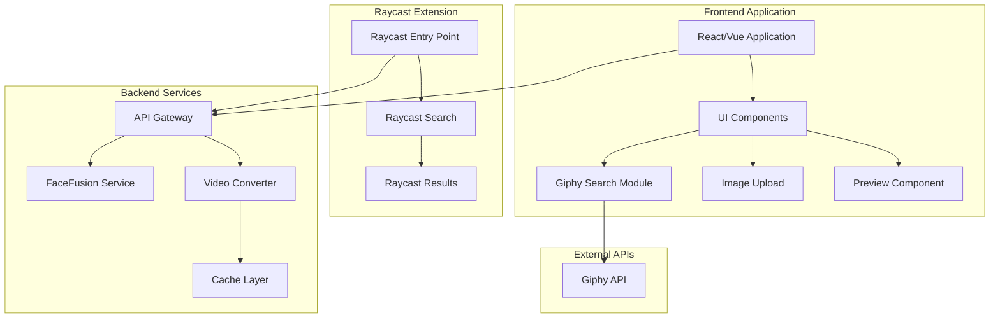
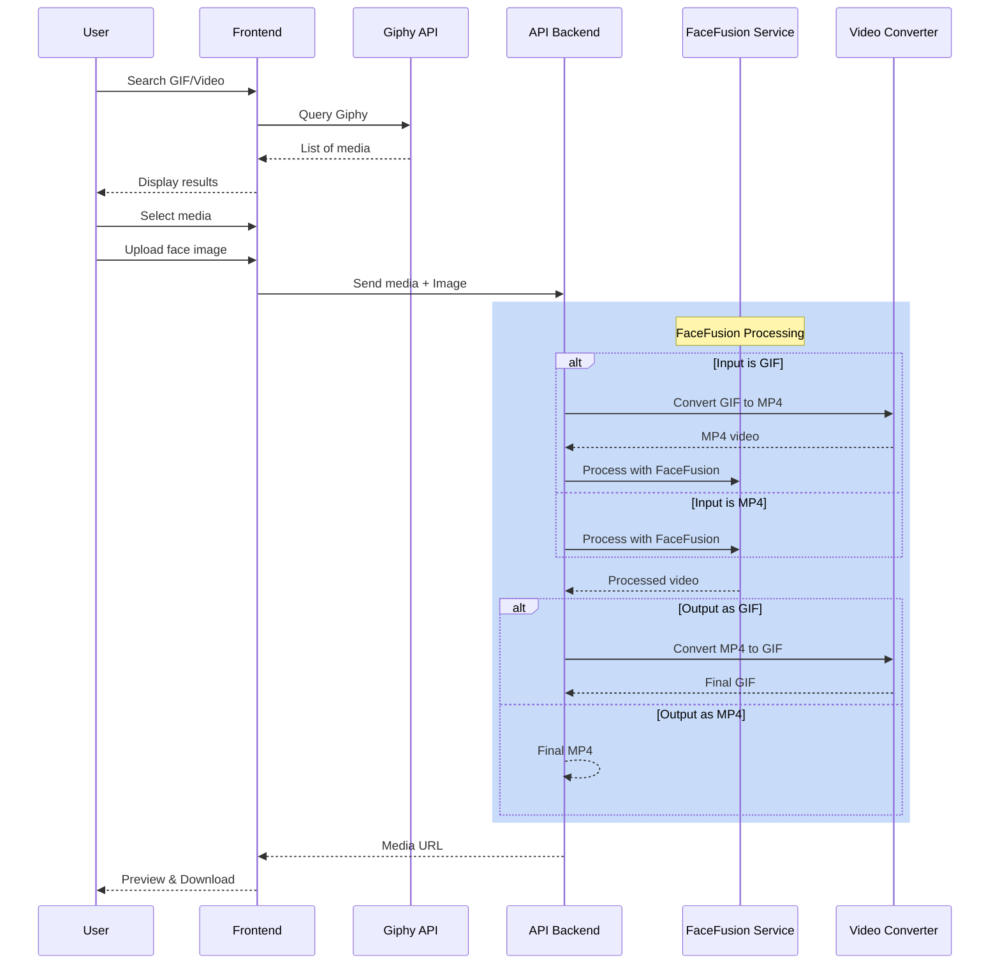
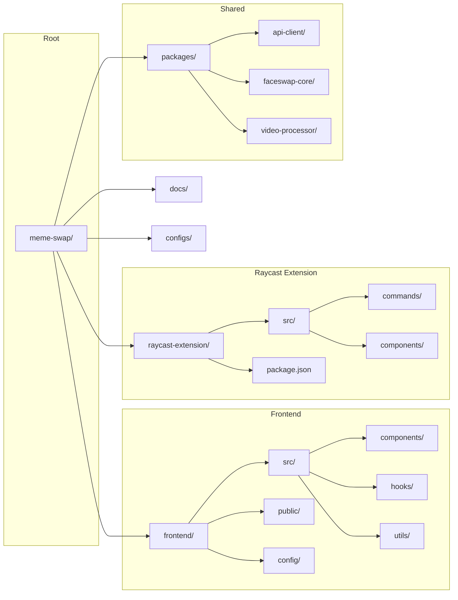
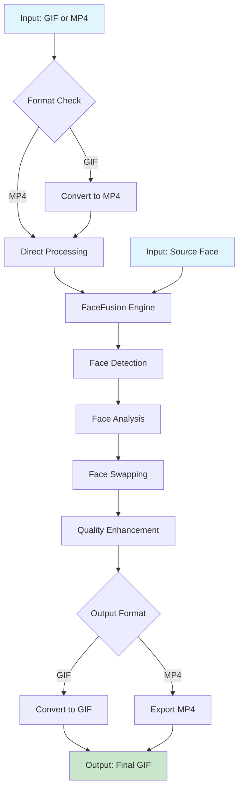
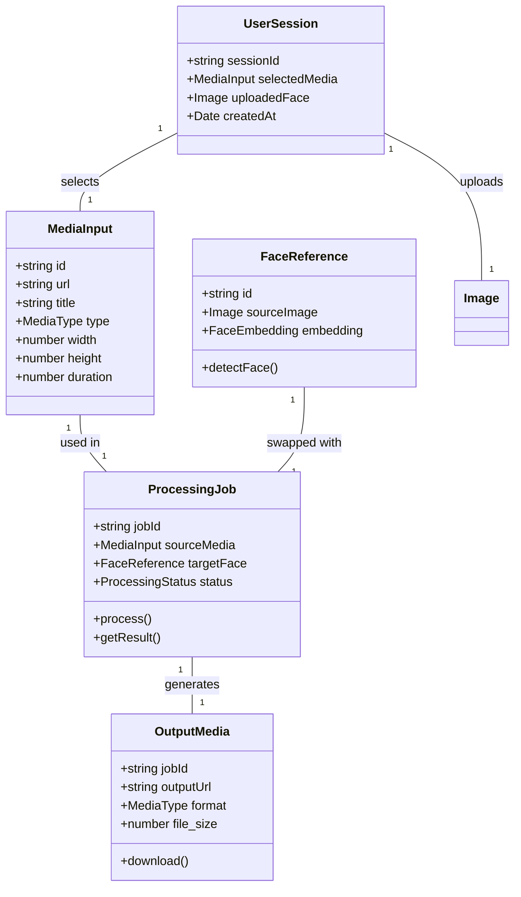
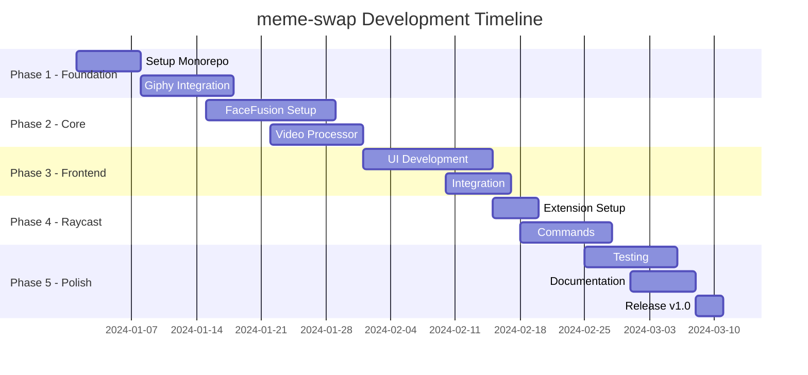

# meme-swap

Swap your favorite gif with a new visage

## 📖 Table of Contents

- [Description](#-description)
- [Architecture](#-architecture)
- [Project Structure](#-project-structure)
- [Prerequisites](#-prerequisites)
- [Installation](#-installation)
- [Usage](#-usage)
- [API & Libraries](#-api--libraries)
- [Contributing](#-contributing)
- [License](#-license)

---

## 📝 Description

**meme-swap** is a mono-repo application that allows you to replace a person's face in animated media (GIFs or videos) with another face of your choice using FaceFusion.

### Core Features

- 🔍 **GIF/Video Search** via Giphy API
- 📂 **Browse and list** popular/trending GIFs
- 🎯 **Select** a target GIF or video
- 📸 **Upload image** (photo of the face to use)
- 🔄 **Automatic faceswap** using FaceFusion engine
- 🎬 **Export** as GIF or MP4 video
- 🔄 **Format conversion**: GIF ↔ MP4 via FFmpeg

---

## 🏗️ Architecture

### Overview



### Media Processing Flow



### Mono Repo Architecture



### Faceswap Process with FaceFusion



---

## 📁 Project Structure

```
meme-swap/
├── frontend/                 # Main React/Vue application
│   ├── src/
│   │   ├── components/       # Reusable UI components
│   │   │   ├── GiphySearch/
│   │   │   ├── ImageUpload/
│   │   │   ├── MediaPreview/
│   │   │   └── FaceswapResult/
│   │   ├── hooks/            # Custom React hooks
│   │   │   ├── useGiphySearch.ts
│   │   │   ├── useFaceswap.ts
│   │   │   └── useVideoProcessor.ts
│   │   ├── services/         # API services
│   │   │   ├── giphy.ts
│   │   │   ├── faceswap.ts
│   │   │   └── videoProcessor.ts
│   │   ├── utils/            # Utilities
│   │   └── types/            # TypeScript definitions
│   ├── public/
│   ├── package.json
│   └── vite.config.ts
│
├── raycast-extension/        # Raycast extension
│   ├── src/
│   │   ├── commands/         # Raycast commands
│   │   │   ├── search-media.ts
│   │   │   ├── faceswap.ts
│   │   │   └── trending.ts
│   │   ├── components/       # Raycast components
│   │   └── lib/              # Extension utilities
│   ├── package.json
│   └── raycast.json
│
├── packages/                 # Shared packages
│   ├── api-client/           # Shared API client
│   │   ├── src/
│   │   │   ├── giphy.ts
│   │   │   └── index.ts
│   │   └── package.json
│   │
│   ├── faceswap-core/        # Core faceswap logic (FaceFusion wrapper)
│   │   ├── src/
│   │   │   ├── processor.ts
│   │   │   ├── options.ts
│   │   │   └── index.ts
│   │   └── package.json
│   │
│   └── video-processor/      # Video/GIF conversion
│       ├── src/
│       │   ├── converter.ts
│       │   ├── encoder.ts
│       │   └── index.ts
│       └── package.json
│
├── docs/                     # Documentation
│   ├── API.md
│   └── ARCHITECTURE.md
│
├── configs/                  # Shared configurations
│   ├── tsconfig.base.json
│   └── eslint.base.js
│
├── turbo.json               # Turborepo configuration
├── package.json             # Root package.json
└── README.md
```

---

## 📋 Prerequisites

### Required Tools

- **Node.js** >= 18.x
- **pnpm** >= 8.x (recommended) or npm
- **Git** >= 2.x
- **FFmpeg** (for GIF/Video conversion)
  - macOS: `brew install ffmpeg`
  - Linux: `sudo apt install ffmpeg`
  - Windows: Download from [ffmpeg.org](https://ffmpeg.org/)
- **Python** >= 3.9 (for FaceFusion)
  - macOS: `brew install python`
  - Linux: `sudo apt install python3 python3-pip`
  - Windows: Download from [python.org](https://python.org/)

### For Raycast Extension

- **Raycast** installed on macOS
- Raycast Developer account

### Required API Keys

- **Giphy API Key** - [Get one here](https://developers.giphy.com/)

---

## 🚀 Installation

### 1. Clone the repository

```bash
git clone git@github.com:Tlahey/meme-swap.git
cd meme-swap
```

### 2. Install dependencies

```bash
# Install all dependencies (monorepo)
pnpm install
```

### 3. Setup FaceFusion

```bash
# Install FaceFusion dependencies
cd packages/faceswap-core
pip install -r requirements.txt

# Or install directly from GitHub
pip install git+https://github.com/facefusion/facefusion.git
```

### 4. Configure environment variables

```bash
# Copy the example file
cp .env.example .env

# Edit the file with your API keys
nano .env
```

```env
# Giphy API
GIPHY_API_KEY=your_giphy_key_here

# FaceFusion configuration
FACEFUSION_EXECUTABLE=python3
FACEFUSION_WORKERS=1

# Optional configuration
GIPHY_API_VERSION=v1
```

### 5. Build the monorepo

```bash
# Build all packages
pnpm build
```

---

## 💻 Usage

### Frontend Application

```bash
# Start the development server
pnpm dev

# Open in browser
open http://localhost:3000
```

### Raycast Extension

```bash
# Install extension in development mode
cd raycast-extension
pnpm link --global

# Or open Raycast > Preferences > Extensions > Develop > Open Development Folder
```

### Available Commands

```bash
# Root commands
pnpm dev          # Start all services in development
pnpm build        # Build all packages
pnpm test         # Run tests
pnpm lint         # Lint code
pnpm clean        # Clean builds

# Frontend specific
pnpm frontend:dev  # Start frontend only
pnpm frontend:build # Build frontend

# Raycast specific
pnpm raycast:dev   # Develop Raycast extension
pnpm raycast:build # Build Raycast extension
```

---

## 🔌 API & Libraries

### External Services

| Service | Usage | Documentation |
|---------|-------|---------------|
| **Giphy API** | Search and retrieve GIFs | [Docs](https://developers.giphy.com/docs/api) |

### Core Libraries

| Package | Description |
|---------|-------------|
| **FaceFusion** | AI-powered face detection, swapping and enhancement |
| **FFmpeg** | Video/GIF conversion (MP4 ↔ GIF) |
| **ONNX Runtime** | Neural network inference for FaceFusion |
| **OpenCV** | Image/video processing |
| **NumPy** | Numerical computations |

### FaceFusion Features

FaceFusion provides advanced face processing capabilities:

- **Face Swapping**: Replace faces with high quality
- **Face Enhancement**: Improve face clarity (FaceShaper, FaceDebugger)
- **Frame Enhancement**: Improve overall video quality
- **Multiple Face Support**: Handle multiple faces in a single frame
- **Expression Retention**: Maintain original facial expressions

### Data Architecture



---

## 🗺️ Roadmap

See [ROADMAP.md](./ROADMAP.md) for detailed development steps.

### Main Phases



---

## 🤝 Contributing

Contributions are welcome! Here's how you can help:

1. **Fork** the repository
2. **Create a branch** for your feature (`git checkout -b feature/amazing-feature`)
3. **Commit** your changes (`git commit -m 'Add: amazing feature'`)
4. **Push** to the branch (`git push origin feature/amazing-feature`)
5. Open a **Pull Request**

### Guidelines

- Follow the existing code style
- Add tests for new features
- Update documentation as needed

---

## 📄 License

This project is licensed under the MIT License. See the [LICENSE](LICENSE) file for details.

---

## 🙏 Acknowledgments

- [Giphy](https://www.giphy.com/) for the GIF API
- [FaceFusion](https://github.com/facefusion/facefusion) for the faceswap engine
- [FFmpeg](https://ffmpeg.org/) for media conversion
- [Raycast](https://www.raycast.com/) for the extension platform
- The open source community

---

## 📞 Contact

For questions or suggestions, please open an issue on the GitHub repository.