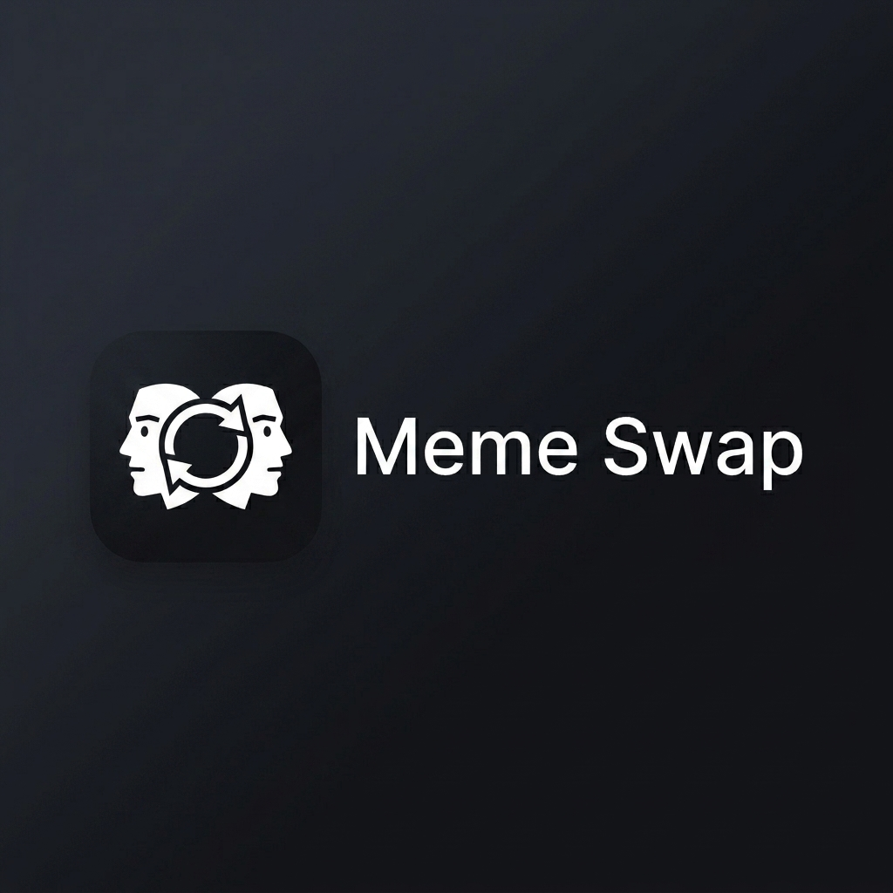
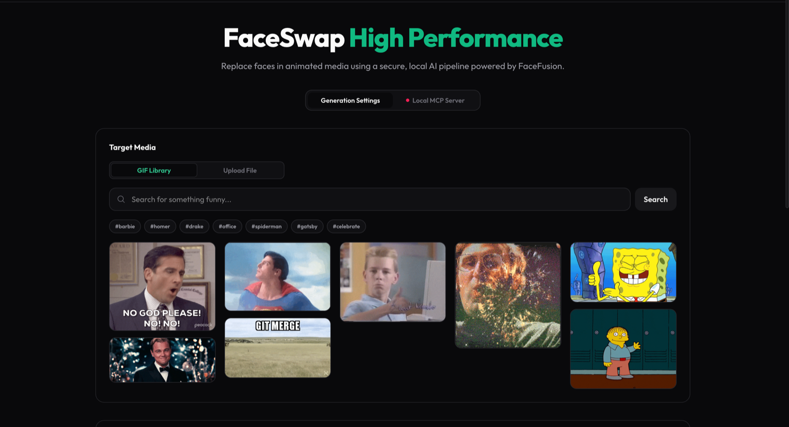
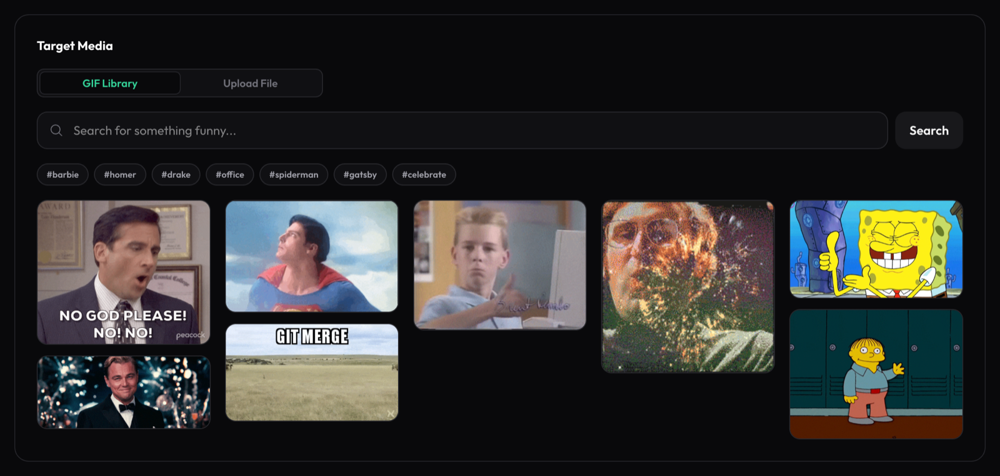
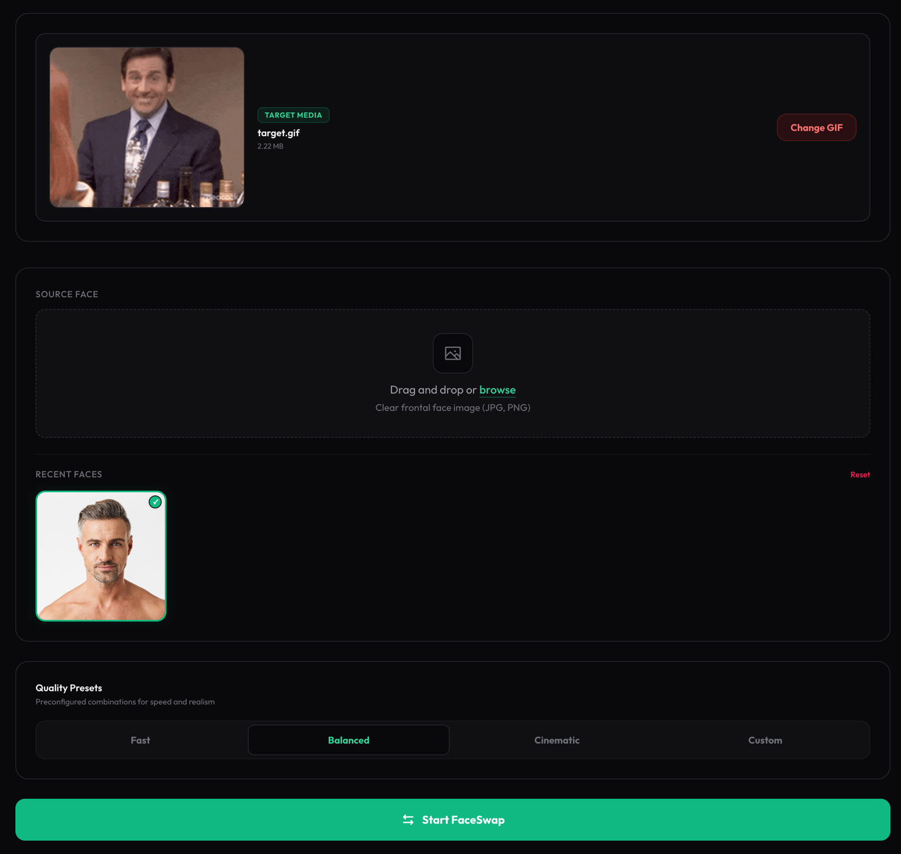
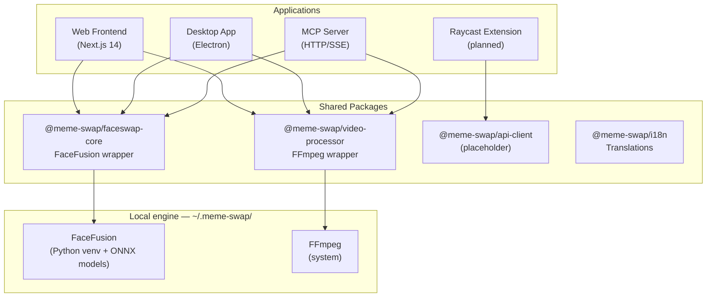
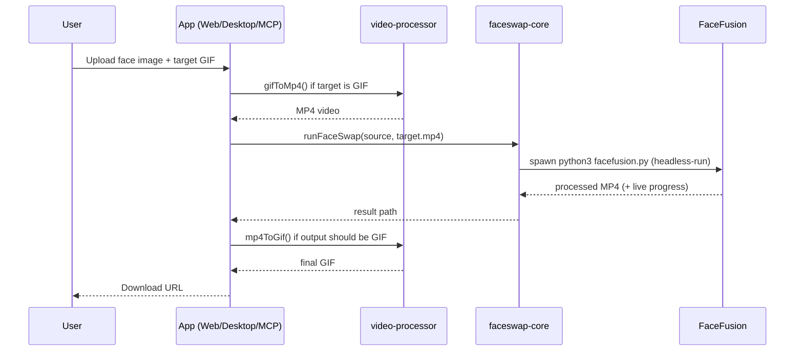

<div align="center">



### Your face. Any meme.

**AI face swapping for GIFs — running 100% locally on your Mac.**<br />
No cloud. No uploads. Just memes.

[**⬇️ Download for Mac**](https://github.com/Tlahey/meme-swap/releases/latest) · [**🌐 Landing page**](https://tlahey.github.io/meme-swap/) · [Installation](#installation) · [Architecture](#architecture) · [Contributing](./CONTRIBUTING.md)

<br />

[](https://github.com/Tlahey/meme-swap/releases/latest)


[](./LICENSE)

</div>

---

**meme-swap** wraps the [FaceFusion](https://github.com/facefusion/facefusion) AI engine in a fully typed TypeScript pipeline, and ships it as three apps that share one local engine:

| Surface | Stack | What you get |
|---|---|---|
| 🌐 **Web app** | Next.js 14 | Drag & drop face swap, Giphy search, model settings, live progress |
| 🖥️ **Desktop app** | Electron | Native macOS app with guided first-run setup, packaged as a `.dmg` |
| 🤖 **MCP server** | Model Context Protocol | Lets AI assistants (Claude, Cursor…) run face swaps as a tool |
| 🚀 **Raycast extension** | Raycast API | Command-palette swaps *(planned)* |

### Why it's different

- 🔒 **Private by design** — models, processing and results all live in `~/.meme-swap/` on your machine. Your face never leaves your Mac, and swapping works fully offline once installed.
- ⚡ **Apple Silicon fast** — inference runs through **CoreML** (Neural Engine + GPU) via ONNX Runtime, with CPU and CUDA fallbacks.
- 🧠 **A real AI pipeline** — not just a swap: `inswapper_128` for identity transfer, **CodeFormer** face restoration, **Real-ESRGAN ×2** frame upscaling, expression restorer and lip syncer, orchestrated per-frame.
- 🎞️ **GIF-native** — FFmpeg handles GIF ↔ MP4 both ways with palette-optimized output, so memes stay memes.
- 🔎 **Giphy, plugged in** — search trending memes right inside the app with hashtag shortcuts; pick a GIF and it's fetched and converted automatically (with a curated offline library when no API key is set).

---

## A Quick Look

<p align="center">
  
</p>

<table>
  <tr>
    <td width="50%">
      
      <p align="center"><sub><strong>Giphy built in</strong> — search, click, swap. No downloads, no tabs.</sub></p>
    </td>
    <td width="50%">
      
      <p align="center"><sub><strong>Ready to swap</strong> — target GIF, source face, quality presets. One button.</sub></p>
    </td>
  </tr>
</table>

---

## Table of Contents

- [Architecture](#architecture)
- [Project Structure](#project-structure)
- [Prerequisites](#prerequisites)
- [Installation](#installation)
- [Running the Apps](#running-the-apps)
- [Packages](#packages)
- [Environment Variables](#environment-variables)
- [Landing Page & Docs](#landing-page--docs)
- [Contributing](#contributing)
- [Responsible Use](#responsible-use)

---

## Architecture



### Processing Pipeline



### AI models in play

| Processor | Model | Role |
|---|---|---|
| Face swapper | `inswapper_128` / `inswapper_128_fp16` | Identity transfer, frame by frame |
| Face enhancer | `codeformer` | Restores and sharpens the swapped face |
| Frame enhancer | `real_esrgan_x2` | Optional ×2 super-resolution of the whole frame |
| Expression restorer | `expression_restorer` | Keeps the original grimaces and blinks |
| Lip syncer | optional | Re-syncs mouth movement to the source audio |

Execution providers: `coreml` (default on Apple Silicon) → `cpu` fallback, `cuda` supported.

---

## Project Structure

```
meme-swap/
├── apps/
│   ├── frontend/             # Next.js 14 web application
│   ├── desktop/              # Electron desktop application
│   ├── mcp-server/           # MCP server (HTTP/SSE transport)
│   └── raycast-extension/    # Raycast extension (placeholder)
│
├── packages/
│   ├── faceswap-core/        # TypeScript wrapper for FaceFusion
│   ├── video-processor/      # FFmpeg wrapper (GIF ↔ MP4)
│   ├── api-client/           # Giphy API client (placeholder)
│   └── i18n/                 # Shared translations (EN/FR)
│
├── website/                  # Landing page (GitHub Pages)
│
├── scripts/
│   └── setup-facefusion.mjs  # FaceFusion one-time installer (CLI wrapper around @meme-swap/installer-core)
│
├── docs/
│   ├── architecture.md       # Detailed architecture notes
│   ├── development.md        # Local development guide
│   └── adr/                  # Architecture Decision Records
│
├── .github/workflows/        # CI — auto-deploys website/ to GitHub Pages
├── configs/                  # Shared ESLint / TS configs
├── turbo.json                # Turborepo pipeline
└── pnpm-workspace.yaml       # pnpm workspace config
```

> **Note:** FaceFusion is installed globally at `~/.meme-swap/facefusion/` and is never bundled inside the repo. All apps resolve it from that path at runtime. Deleting `~/.meme-swap/` removes every model, cache and result.

---

## Prerequisites

| Tool | Version | Install |
|---|---|---|
| Node.js | ≥ 18 | [nodejs.org](https://nodejs.org) |
| pnpm | ≥ 9 | `npm i -g pnpm` |
| Python | ≥ 3.9 | `brew install python` |
| FFmpeg | any | `brew install ffmpeg` |
| Git | ≥ 2 | pre-installed on macOS |

---

## Installation

### Option 1 — Download the desktop app (recommended)

Grab the latest `.dmg` (Apple Silicon) from the [**Releases page**](https://github.com/Tlahey/meme-swap/releases/latest), open it and drag **Meme Swap.app** into Applications. The guided first-run setup installs FaceFusion into `~/.meme-swap/` for you.

> The app isn't notarized yet — on first launch, right-click **Meme Swap.app** → **Open** to bypass the Gatekeeper warning.

### Option 2 — Build from source

```bash
# 1. Clone & install the monorepo
git clone https://github.com/Tlahey/meme-swap.git && cd meme-swap
pnpm install

# 2. One-time: install FaceFusion + Python venv into ~/.meme-swap
pnpm install:facefusion

# 3. Configure environment (optional)
cp .env.example .env.local

# 4. Build all packages
pnpm build
```

---

## Running the Apps

### Web Frontend

```bash
pnpm frontend:dev
# → http://localhost:3010
```

### Desktop App (Electron)

```bash
pnpm desktop:dev
```

#### Build a distributable DMG

```bash
pnpm build            # 1. Build all shared packages
pnpm desktop:build    # 2. Compile the desktop TypeScript + copy assets
pnpm desktop:package  # 3. Package into a .dmg via electron-builder
```

The `.dmg` is output to `apps/desktop/dist/`. Double-click it to install **Meme Swap.app** into your Applications folder.

> **Note:** `gatekeeperAssess` is disabled in the build config, so macOS may show an unverified developer warning. Right-click → Open to bypass it, or sign the app with an Apple Developer certificate.

### MCP Server

```bash
# Build first
pnpm build --filter=mcp-server

# Start
cd apps/mcp-server && pnpm start
# → http://localhost:3001
```

To use the MCP server with an AI client (e.g. Cursor), add to your MCP config:

```json
{
  "mcpServers": {
    "meme-swap": {
      "command": "node",
      "args": ["<absolute-path>/apps/mcp-server/build/index.js"]
    }
  }
}
```

Available MCP tools:
- **`run_faceswap`** — perform a face swap given a source image and target media path

See [`apps/mcp-server/README.md`](./apps/mcp-server/README.md) for the full API reference.

---

## Packages

### `@meme-swap/faceswap-core`

TypeScript wrapper around the FaceFusion Python CLI.

```typescript
import { runFaceSwap } from '@meme-swap/faceswap-core';

const result = await runFaceSwap({
  sourcePath: './face.jpg',
  targetPath: './target.mp4',
  outputPath: './output.mp4',
  executionProviders: ['coreml', 'cpu'], // Apple Silicon
  faceSwapperModel: 'inswapper_128_fp16',
  faceEnhancerModel: 'codeformer',
  threadCount: 4,
  logLevel: 'info',
  onProgress: ({ step, percent }) => console.log(step, percent),
});

if (result.success) {
  console.log('Output:', result.outputPath);
}
```

| Option | Type | Default | Description |
|---|---|---|---|
| `sourcePath` | `string` | — | Source face image |
| `targetPath` | `string` | — | Target video (must be MP4) |
| `outputPath` | `string` | — | Output file path |
| `executionProviders` | `('coreml' \| 'cpu' \| 'cuda')[]` | `['coreml','cpu']` | Hardware accelerators |
| `faceSelectorMode` | `string` | — | `'many'`, `'one'`, `'reference'` |
| `faceSwapperModel` | `string` | — | e.g. `inswapper_128_fp16` |
| `faceEnhancerModel` | `string` | — | e.g. `codeformer` |
| `frameEnhancerModel` | `string` | — | e.g. `real_esrgan_x2` |
| `expressionRestorerModel` | `string` | — | Restores original expressions |
| `lipSyncerModel` | `string` | — | Re-syncs lips to source audio |
| `threadCount` | `number` | auto | Parallel execution threads |
| `logLevel` | `'debug' \| 'info' \| 'warning' \| 'error'` | `'info'` | Log verbosity |
| `onProgress` | `(p) => void` | — | Live progress callback (analysing / extracting / processing / merging) |

### `@meme-swap/video-processor`

FFmpeg wrapper for format conversion.

```typescript
import { gifToMp4, mp4ToGif } from '@meme-swap/video-processor';

// GIF → MP4 (required before running FaceFusion)
await gifToMp4({ inputPath: './input.gif', outputPath: './input.mp4' });

// MP4 → GIF (for final output)
await mp4ToGif({
  inputPath: './output.mp4',
  outputPath: './output.gif',
  fps: 10,
  maxWidth: 480,
});
```

---

## Environment Variables

Copy `.env.example` to `.env.local` and configure:

```bash
# Optional — Giphy API client (not yet active)
GIPHY_API_KEY=your_key_here

# FaceFusion execution providers (default: coreml,cpu on Apple Silicon)
FACEFUSION_EXECUTION_PROVIDERS=coreml,cpu

# Thread count for FaceFusion (default: auto-detected)
FACEFUSION_THREAD_COUNT=8

# Port for the web frontend dev server
PORT=3010
```

---

## Landing Page & Docs

The project landing page lives in [`website/`](./website) and is deployed automatically to **[tlahey.github.io/meme-swap](https://tlahey.github.io/meme-swap/)** by the [`deploy-pages`](./.github/workflows/deploy-pages.yml) GitHub Actions workflow on every push to `main` that touches `website/**`.

> **One-time setup:** in the repo settings, set **Settings → Pages → Source** to **GitHub Actions**.

More docs:
- [`docs/architecture.md`](./docs/architecture.md) — detailed architecture notes
- [`docs/development.md`](./docs/development.md) — local development guide
- [`docs/adr/`](./docs/adr) — Architecture Decision Records

---

## Contributing

See [CONTRIBUTING.md](./CONTRIBUTING.md) for the full guide.

Quick summary:
1. Fork the repo and create a branch: `feature/<name>` or `fix/<name>`
2. Follow the [code style rules](./AGENTS.md) — TypeScript strict mode, named exports, async/await
3. Open a pull request with a clear description

---

## Responsible Use

Meme Swap is built for entertainment and creative use. **Always get consent** before swapping someone's face, and never use it to deceive, impersonate or harm anyone. You are responsible for the content you create.

---

## License

[MIT](./LICENSE) © Tlahey

---

## Acknowledgments

- [FaceFusion](https://github.com/facefusion/facefusion) — AI face manipulation platform
- [InsightFace](https://github.com/deepinsight/insightface) — `inswapper` face swap model
- [CodeFormer](https://github.com/sczhou/CodeFormer) — face restoration
- [Real-ESRGAN](https://github.com/xinntao/Real-ESRGAN) — super-resolution
- [FFmpeg](https://ffmpeg.org/) — media conversion
- [Raycast](https://www.raycast.com/) — extension platform
