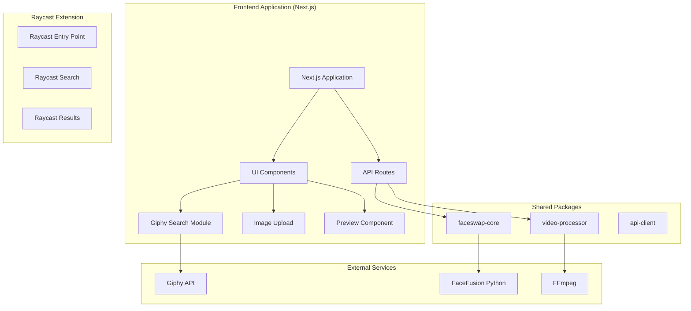
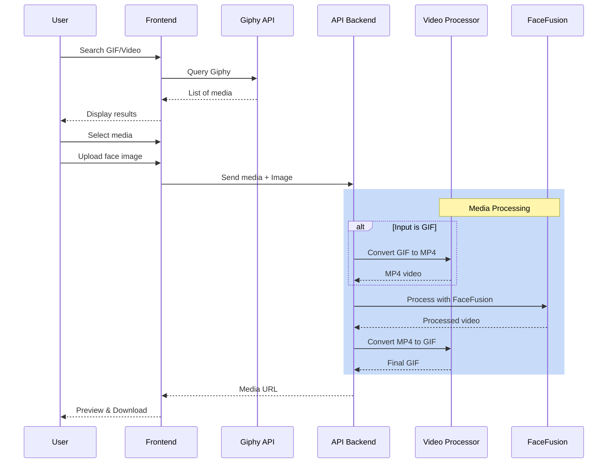

# meme-swap

Swap faces in animated media (GIFs and videos) using FaceFusion.

## 📋 Table of Contents

- [Description](#-description)
- [Architecture](#-architecture)
- [Project Structure](#-project-structure)
- [Prerequisites](#-prerequisites)
- [Installation](#-installation)
- [Usage](#-usage)
- [API & Libraries](#-api--libraries)
- [Contributing](#-contributing)
- [License](#-license)

---

## 📝 Description

**meme-swap** is a monorepo application that allows you to replace a person's face in animated media (GIFs or videos) with another face of your choice using FaceFusion.

### Core Features

- 🔍 **GIF/Video Search** via Giphy API
- 📂 **Browse and list** popular/trending GIFs
- 🎯 **Select** a target GIF or video
- 📸 **Upload image** (photo of the face to use)
- 🔄 **Automatic faceswap** using FaceFusion engine
- 🎬 **Export** as GIF or MP4 video
- 🔄 **Format conversion**: GIF ↔ MP4 via FFmpeg

---

## 🏗️ Architecture

### Overview



### Media Processing Flow



---

## 📁 Project Structure

```
meme-swap/
├── apps/                     # Application packages
│   ├── frontend/             # Next.js application
│   │   ├── app/              # App Router (Next.js 13+)
│   │   │   ├── api/
│   │   │   │   └── faceswap/
│   │   │   │       └── route.ts    # Face swap API endpoint
│   │   │   ├── page.tsx            # Main page with upload UI
│   │   │   ├── layout.tsx          # Root layout
│   │   │   └── globals.css         # Global styles
│   │   ├── public/
│   │   │   └── test-images/        # Test images directory
│   │   ├── next.config.js
│   │   ├── tsconfig.json
│   │   └── package.json
│   │
│   └── raycast-extension/    # Raycast extension (placeholder)
│       └── .keep
│
├── packages/                 # Shared packages
│   ├── faceswap-core/        # Core faceswap logic (FaceFusion wrapper)
│   │   ├── src/
│   │   │   └── index.ts            # Main exports
│   │   ├── dist/                   # Compiled output
│   │   ├── package.json
│   │   └── tsconfig.json
│   │
│   ├── video-processor/      # Video/GIF conversion (FFmpeg wrapper)
│   │   ├── src/
│   │   │   └── index.ts            # Main exports
│   │   ├── dist/                   # Compiled output
│   │   ├── package.json
│   │   └── tsconfig.json
│   │
│   └── api-client/           # Shared API client (placeholder)
│       └── .keep
│
├── vendor/                   # Third-party dependencies
│   └── facefusion/           # FaceFusion Python package
│       ├── venv/             # Python virtual environment
│       ├── facefusion.py     # Main entry point
│       └── facefusion/       # FaceFusion module
│
├── .process/                 # Working directory (gitignored)
│   ├── temp/                 # Temporary files during processing
│   └── results/              # Generated output files
│
├── docs/                     # Documentation
│   └── .keep
│
├── configs/                  # Shared configurations
│   └── .keep
│
├── scripts/                  # Utility scripts
│   └── setup-facefusion.sh   # FaceFusion installation script
│
├── turbo.json               # Turborepo configuration
├── pnpm-workspace.yaml      # pnpm workspace config
├── package.json             # Root package.json
└── README.md
```

---

## 📋 Prerequisites

### Required Tools

- **Node.js** >= 18.x
- **pnpm** >= 8.x (recommended)
- **Git** >= 2.x
- **FFmpeg** (for GIF/Video conversion)
  - macOS: `brew install ffmpeg`
  - Linux: `sudo apt install ffmpeg`
  - Windows: Download from [ffmpeg.org](https://ffmpeg.org/)
- **Python** >= 3.9 (for FaceFusion)
  - macOS: `brew install python`
  - Linux: `sudo apt install python3 python3-pip`
  - Windows: Download from [python.org](https://python.org/)

### For Raycast Extension

- **Raycast** installed on macOS
- Raycast Developer account

### Required API Keys

- **Giphy API Key** - [Get one here](https://developers.giphy.com/)

---

## 🚀 Installation

### 1. Clone the repository

```bash
git clone git@github.com:Tlahey/meme-swap.git
cd meme-swap
```

### 2. Install dependencies

```bash
# Install all dependencies (monorepo)
pnpm install
```

This will:
- Install all npm dependencies across the monorepo
- Run the FaceFusion setup script automatically (via `postinstall`)

### 3. Setup FaceFusion

FaceFusion is automatically installed via the postinstall script. To manually set it up:

```bash
# Run the setup script
pnpm install:facefusion
```

This will:
- Clone FaceFusion from GitHub into `vendor/facefusion/`
- Create a Python virtual environment
- Install all required Python dependencies
- Install `onnxruntime-silicon` for Apple Silicon optimization

### 4. Build the monorepo

```bash
# Build all packages
pnpm build
```

---

## 💻 Usage

### Frontend Application

```bash
# Start the development server
pnpm frontend:dev

# Open in browser
open http://localhost:3000
```

#### Using Test Images

1. Place your test images in `apps/frontend/public/test-images/`:
   - `source.jpg` - The face image to transfer
   - `target.gif` - The target GIF/video

2. Upload these files through the web interface at http://localhost:3000

### Available Commands

```bash
# Root commands
pnpm dev              # Start all services in development
pnpm build            # Build all packages
pnpm test             # Run tests
pnpm lint             # Lint code
pnpm clean            # Clean builds
pnpm install:facefusion  # Setup FaceFusion

# Frontend specific
pnpm frontend:dev         # Start frontend only
pnpm frontend:build       # Build frontend

# Raycast specific
pnpm raycast:dev          # Develop Raycast extension
pnpm raycast:build        # Build Raycast extension

# Package specific
pnpm faceswap-core:build  # Build faceswap-core package
pnpm video-processor:build  # Build video-processor package

# CLI Tools
pnpm test:faceswap --source=./test-assets/source.jpg --target=./test-assets/target.gif --output=./test-assets/output.mp4
```

#### Script CLI de test

Le projet inclut un script CLI pour tester le face swap en ligne de commande :

```bash
# Utilisation de base
pnpm test:faceswap --source=<image-source> --target=<media-cible> --output=<sortie>

# Exemple avec GIF
pnpm test:faceswap \
  --source=./test-assets/source.jpg \
  --target=./test-assets/target.gif \
  --output=./test-assets/output.mp4

# Exemple avec MP4
pnpm test:faceswap \
  --source=./test-assets/source.jpg \
  --target=./test-assets/target.mp4 \
  --output=./test-assets/output.mp4

# Options avancées
pnpm test:faceswap \
  --source=./test-assets/source.jpg \
  --target=./test-assets/target.gif \
  --output=./test-assets/output.mp4 \
  --providers=cpu

# Afficher l'aide
pnpm test:faceswap --help
```

**Arguments :**
- `--source` : Image source contenant le visage à transférer (requis)
- `--target` : Média cible (GIF ou MP4) (requis)
- `--output` : Chemin de sortie pour le résultat (requis)
- `--providers` : Fournisseurs d'exécution (par défaut: coreml,cpu)

**Fichiers de test :**

Des fichiers de test sont disponibles dans le répertoire `test-assets/`. Consultez [test-assets/README.md](./test-assets/README.md) pour plus d'informations sur la préparation des images et des GIFs de test.

---

## 🔌 API & Libraries

### Shared Packages

#### `@meme-swap/faceswap-core`

TypeScript wrapper for FaceFusion Python execution.

**Installation:** (included in monorepo)

**Usage:**

```typescript
import { runFaceSwap, FaceswapOptions } from '@meme-swap/faceswap-core';

const options: FaceswapOptions = {
  sourcePath: './source.jpg',      // Source face image
  targetPath: './target.mp4',      // Target video (MP4)
  outputPath: './output.mp4',      // Output path
  executionProviders: ['coreml', 'cpu'],  // Apple Silicon optimization
  faceSelector: 'many',            // Face selector mode
  threadCount: 4,                  // Number of threads
  logLevel: 'info',                // Log level
};

const result = await runFaceSwap(options);

if (result.success) {
  console.log('Success:', result.outputPath);
} else {
  console.error('Error:', result.error);
}
```

**Options Interface:**

| Option | Type | Description |
|--------|------|-------------|
| `sourcePath` | `string` | Path to source face image (required) |
| `targetPath` | `string` | Path to target video (required) |
| `outputPath` | `string` | Output file path (required) |
| `executionProviders` | `('coreml' \| 'cpu' \| 'cuda')[]` | Execution providers (default: `['coreml', 'cpu']`) |
| `faceSelector` | `string` | Face selector mode: 'many', 'reference', 'one', 'first' |
| `faceSwapperModel` | `string` | Face swapper model to use |
| `threadCount` | `number` | Number of execution threads |
| `logLevel` | `'debug' \| 'info' \| 'warning' \| 'error'` | Logging level |
| `keepTemp` | `boolean` | Keep temporary files |

#### `@meme-swap/video-processor`

FFmpeg wrapper for GIF/MP4 conversions.

**Usage:**

```typescript
import { gifToMp4, mp4ToGif } from '@meme-swap/video-processor';

// Convert GIF to MP4
const result1 = await gifToMp4({
  inputPath: './input.gif',
  outputPath: './output.mp4',
});

// Convert MP4 to GIF (with options)
const result2 = await mp4ToGif({
  inputPath: './input.mp4',
  outputPath: './output.gif',
  fps: 10,           // Frames per second (default: 10)
  maxWidth: 320,     // Maximum width (default: 320)
});
```

**Options Interface:**

| Option | Type | Default | Description |
|--------|------|---------|-------------|
| `inputPath` | `string` | - | Input file path (required) |
| `outputPath` | `string` | - | Output file path (required) |
| `fps` | `number` | `10` | Frames per second for GIF output |
| `maxWidth` | `number` | `320` | Maximum width for GIF output |

### External Services

| Service | Usage | Documentation |
|---------|-------|---------------|
| **Giphy API** | Search and retrieve GIFs | [Docs](https://developers.giphy.com/docs/api) |

### Core Libraries

| Library | Description |
|---------|-------------|
| **FaceFusion** | AI-powered face detection, swapping and enhancement |
| **FFmpeg** | Video/GIF conversion (MP4 ↔ GIF) |
| **ONNX Runtime** | Neural network inference for FaceFusion |
| **OpenCV** | Image/video processing |
| **NumPy** | Numerical computations |

### FaceFusion Features

FaceFusion provides advanced face processing capabilities:

- **Face Swapping**: Replace faces with high quality
- **Face Enhancement**: Improve face clarity (FaceShaper, FaceDebugger)
- **Frame Enhancement**: Improve overall video quality
- **Multiple Face Support**: Handle multiple faces in a single frame
- **Expression Retention**: Maintain original facial expressions

---

## 🗺️ Roadmap

See [ROADMAP.md](./ROADMAP.md) for detailed development steps.

---

## 🤝 Contributing

Contributions are welcome! Here's how you can help:

1. **Fork** the repository
2. **Create a branch** for your feature (`git checkout -b feature/amazing-feature`)
3. **Commit** your changes (`git commit -m 'Add: amazing feature'`)
4. **Push** to the branch (`git push origin feature/amazing-feature`)
5. Open a **Pull Request**

### Guidelines

- Follow the existing code style (TypeScript first)
- Add tests for new features
- Update documentation as needed
- See [AGENTS.md](./AGENTS.md) for development rules and guidelines

---

## 📄 License

This project is licensed under the MIT License. See the [LICENSE](LICENSE) file for details.

---

## 🙏 Acknowledgments

- [Giphy](https://www.giphy.com/) for the GIF API
- [FaceFusion](https://github.com/facefusion/facefusion) for the faceswap engine
- [FFmpeg](https://ffmpeg.org/) for media conversion
- [Raycast](https://www.raycast.com/) for the extension platform
- The open source community

---

## 📞 Contact

For questions or suggestions, please open an issue on the GitHub repository.