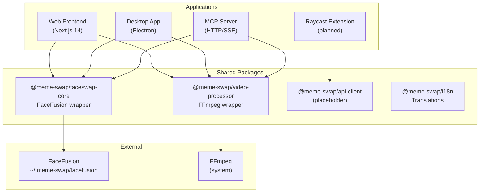
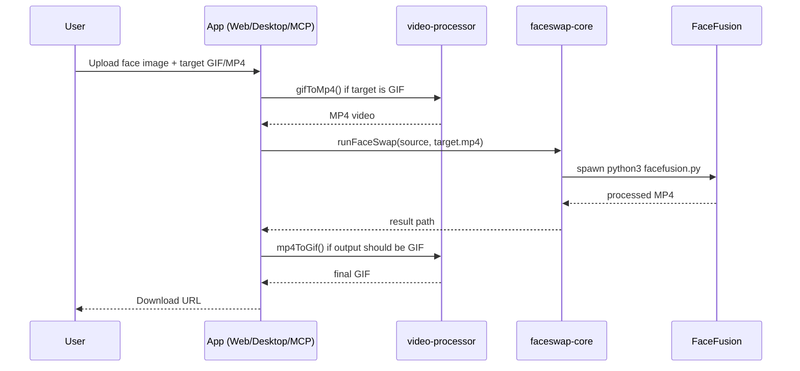

# meme-swap

> Swap faces in animated GIFs and videos using [FaceFusion](https://github.com/facefusion/facefusion) — available as a web app, desktop app, and MCP server.

---

## Table of Contents

- [Overview](#overview)
- [Architecture](#architecture)
- [Project Structure](#project-structure)
- [Prerequisites](#prerequisites)
- [Installation](#installation)
- [Running the Apps](#running-the-apps)
- [Packages](#packages)
- [Environment Variables](#environment-variables)
- [Contributing](#contributing)

---

## Overview

**meme-swap** is a TypeScript monorepo (Turborepo + pnpm) that wraps the FaceFusion Python engine to provide face-swapping across multiple surfaces:

| Surface | Description |
|---|---|
| **Web Frontend** | Next.js 14 app — drag & drop face swap in the browser |
| **Desktop App** | Electron app — native macOS experience with system tray |
| **MCP Server** | Model Context Protocol server — lets AI assistants (Cursor, Claude) trigger face swaps |
| **Raycast Extension** | macOS Raycast command palette integration *(planned)* |

### Core Features

- 🎯 Upload a face image + a target GIF or MP4
- 🤖 Automatic face swap powered by FaceFusion
- 🔄 Seamless GIF ↔ MP4 conversion via FFmpeg
- 📥 Download the result as GIF or MP4
- 🖥️ Native desktop app with guided first-time setup
- 🔌 MCP tool for AI-driven automation

---

## Architecture



### Processing Pipeline



---

## Project Structure

```
meme-swap/
├── apps/
│   ├── frontend/             # Next.js 14 web application
│   ├── desktop/              # Electron desktop application
│   ├── mcp-server/           # MCP server (HTTP/SSE transport)
│   └── raycast-extension/    # Raycast extension (placeholder)
│
├── packages/
│   ├── faceswap-core/        # TypeScript wrapper for FaceFusion
│   ├── video-processor/      # FFmpeg wrapper (GIF ↔ MP4)
│   ├── api-client/           # Giphy API client (placeholder)
│   └── i18n/                 # Shared translations
│
├── scripts/
│   └── setup-facefusion.sh   # FaceFusion one-time installer
│
├── docs/
│   ├── architecture.md       # Detailed architecture notes
│   ├── development.md        # Local development guide
│   └── adr/                  # Architecture Decision Records
│
├── configs/                  # Shared ESLint / TS configs
├── turbo.json                # Turborepo pipeline
├── pnpm-workspace.yaml       # pnpm workspace config
└── package.json
```

> **Note:** FaceFusion is installed globally at `~/.meme-swap/facefusion/` and is never bundled inside the repo. All apps resolve it from that path at runtime.

---

## Prerequisites

| Tool | Version | Install |
|---|---|---|
| Node.js | ≥ 18 | [nodejs.org](https://nodejs.org) |
| pnpm | ≥ 9 | `npm i -g pnpm` |
| Python | ≥ 3.9 | `brew install python` |
| FFmpeg | any | `brew install ffmpeg` |
| Git | ≥ 2 | pre-installed on macOS |

---

## Installation

### 1. Clone

```bash
git clone git@github.com:Tlahey/meme-swap.git
cd meme-swap
```

### 2. Install dependencies

```bash
pnpm install
```

### 3. Set up FaceFusion

This clones FaceFusion into `~/.meme-swap/facefusion/` and creates a Python virtual environment with all required dependencies. **Only needs to be run once.**

```bash
pnpm install:facefusion
```

### 4. Configure environment

```bash
cp .env.example .env.local
# Edit .env.local as needed
```

### 5. Build all packages

```bash
pnpm build
```

---

## Running the Apps

### Web Frontend

```bash
pnpm frontend:dev
# → http://localhost:3010
```

### Desktop App (Electron)

```bash
pnpm desktop:dev
```

#### Build a distributable DMG

```bash
# 1. Build all shared packages
pnpm build

# 2. Compile the desktop TypeScript + copy assets
pnpm desktop:build

# 3. Package into a .dmg via electron-builder
pnpm desktop:package
```

The `.dmg` is output to `apps/desktop/dist/`. Double-click it to install **Meme Swap.app** into your Applications folder.

> **Note:** `gatekeeperAssess` is disabled in the build config, so macOS may show an unverified developer warning. Right-click → Open to bypass it, or sign the app with an Apple Developer certificate.

### MCP Server

```bash
# Build first
pnpm build --filter=mcp-server

# Start
cd apps/mcp-server && pnpm start
# → http://localhost:3001
```

To use the MCP server with an AI client (e.g. Cursor), add to your MCP config:

```json
{
  "mcpServers": {
    "meme-swap": {
      "command": "node",
      "args": ["<absolute-path>/apps/mcp-server/build/index.js"]
    }
  }
}
```

Available MCP tools:
- **`run_faceswap`** — perform a face swap given a source image and target media path

See [`apps/mcp-server/README.md`](./apps/mcp-server/README.md) for the full API reference.

---

## Packages

### `@meme-swap/faceswap-core`

TypeScript wrapper around the FaceFusion Python CLI.

```typescript
import { runFaceSwap } from '@meme-swap/faceswap-core';

const result = await runFaceSwap({
  sourcePath: './face.jpg',
  targetPath: './target.mp4',
  outputPath: './output.mp4',
  executionProviders: ['coreml', 'cpu'], // Apple Silicon
  threadCount: 4,
  logLevel: 'info',
});

if (result.success) {
  console.log('Output:', result.outputPath);
}
```

| Option | Type | Default | Description |
|---|---|---|---|
| `sourcePath` | `string` | — | Source face image |
| `targetPath` | `string` | — | Target video (must be MP4) |
| `outputPath` | `string` | — | Output file path |
| `executionProviders` | `('coreml' \| 'cpu' \| 'cuda')[]` | `['coreml','cpu']` | Hardware accelerators |
| `faceSelector` | `string` | — | `'many'`, `'one'`, `'reference'`, `'first'` |
| `threadCount` | `number` | auto | Parallel execution threads |
| `logLevel` | `'debug' \| 'info' \| 'warning' \| 'error'` | `'info'` | Log verbosity |

### `@meme-swap/video-processor`

FFmpeg wrapper for format conversion.

```typescript
import { gifToMp4, mp4ToGif } from '@meme-swap/video-processor';

// GIF → MP4 (required before running FaceFusion)
await gifToMp4({ inputPath: './input.gif', outputPath: './input.mp4' });

// MP4 → GIF (for final output)
await mp4ToGif({
  inputPath: './output.mp4',
  outputPath: './output.gif',
  fps: 10,
  maxWidth: 480,
});
```

---

## Environment Variables

Copy `.env.example` to `.env.local` and configure:

```bash
# Optional — Giphy API client (not yet active)
GIPHY_API_KEY=your_key_here

# FaceFusion execution providers (default: coreml,cpu on Apple Silicon)
FACEFUSION_EXECUTION_PROVIDERS=coreml,cpu

# Thread count for FaceFusion (default: auto-detected)
FACEFUSION_THREAD_COUNT=8

# Port for the web frontend dev server
PORT=3010
```

---

## Contributing

See [CONTRIBUTING.md](./CONTRIBUTING.md) for the full guide.

Quick summary:
1. Fork the repo and create a branch: `feature/<name>` or `fix/<name>`
2. Follow the [code style rules](./AGENTS.md) — TypeScript strict mode, named exports, async/await
3. Open a pull request with a clear description

---

## Acknowledgments

- [FaceFusion](https://github.com/facefusion/facefusion) — AI face swapping engine
- [FFmpeg](https://ffmpeg.org/) — media conversion
- [Raycast](https://www.raycast.com/) — extension platform