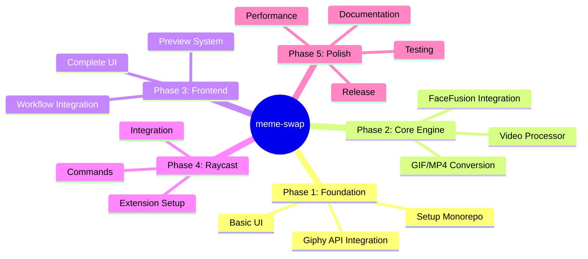

# 🗺️ Roadmap - meme-swap

This document describes the development steps for the **meme-swap** project.

---

## 📌 Overview



---

## 🎯 Phase 1: Foundation (Weeks 1-2)

### 1.1 Setup Monorepo

**Goal**: Set up the basic monorepo infrastructure

- [ ] **Initialize Git repository**
  ```bash
  git init
  git add .
  git commit -m "Initial commit"
  ```

- [ ] **Configure Turborepo**
  - [ ] Create `turbo.json`
  - [ ] Configure build pipelines
  - [ ] Define caches

- [ ] **Configure pnpm workspaces**
  - [ ] Create `pnpm-workspace.yaml`
  - [ ] Configure root `package.json`
  - [ ] Define common scripts

- [ ] **Share configurations**
  - [ ] `tsconfig.base.json`
  - [ ] `eslint.base.js`
  - [ ] `.editorconfig`

**Deliverable**: Functional monorepo with build

### 1.2 Giphy API Integration

**Goal**: Integrate Giphy API for GIF search

- [ ] **Create `api-client` package**
  ```
  packages/api-client/
  ├── src/
  │   ├── giphy.ts
  │   ├── types.ts
  │   └── index.ts
  └── package.json
  ```

- [ ] **Implement Giphy endpoints**
  - [ ] `search(query, limit, offset)`
  - [ ] `trending(limit, rating)`
  - [ ] `gifById(id)`
  - [ ] `random(query)`

- [ ] **Error handling and retry**
  - [ ] Rate limiting
  - [ ] Error handling
  - [ ] Retry logic

- [ ] **Unit tests**
  - [ ] Mock Giphy API
  - [ ] Test each endpoint

**Deliverable**: Functional API client package

### 1.3 Basic UI Structure

**Goal**: Create basic frontend application structure

- [ ] **Initialize Vite + React + TypeScript**
  ```bash
  pnpm create vite frontend --template react-ts
  ```

- [ ] **Install UI dependencies**
  - [ ] TailwindCSS
  - [ ] Radix UI / shadcn/ui
  - [ ] React Query (TanStack Query)

- [ ] **Create base layout**
  - [ ] Header
  - [ ] Main content area
  - [ ] Footer

- [ ] **Routing setup**
  - [ ] React Router
  - [ ] Basic routes

**Deliverable**: Frontend application with layout

---

## ⚙️ Phase 2: Core Engine (Weeks 3-5)

### 2.1 FaceFusion Integration

**Goal**: Integrate FaceFusion for face swapping

- [ ] **Setup FaceFusion environment**
  - [ ] Install Python >= 3.9
  - [ ] Install FFmpeg dependencies
  - [ ] Install ONNX Runtime (CPU/GPU)

- [ ] **Create `faceswap-core` package**
  ```
  packages/faceswap-core/
  ├── src/
  │   ├── processor.ts      # FaceFusion wrapper
  │   ├── options.ts        # Processing options
  │   ├── types.ts
  │   └── index.ts
  ├── requirements.txt
  └── package.json
  ```

- [ ] **Implement FaceFusion wrapper**
  - [ ] Face detection
  - [ ] Face swapping
  - [ ] Face enhancement
  - [ ] Multiple face handling

- [ ] **Configure FaceFusion options**
  - [ ] Source face image handling
  - [ ] Face selector mode
  - [ ] Face mask types
  - [ ] Frame processors

- [ ] **Tests**
  - [ ] Test face detection
  - [ ] Test face swapping
  - [ ] Quality verification

**Deliverable**: Functional FaceFusion integration

### 2.2 Video Processor Package

**Goal**: Create video/GIF conversion package

- [ ] **Create `video-processor` package**
  ```
  packages/video-processor/
  ├── src/
  │   ├── converter.ts      # Format conversion
  │   ├── encoder.ts        # GIF encoding
  │   ├── types.ts
  │   └── index.ts
  └── package.json
  ```

- [ ] **Implement GIF to MP4 conversion**
  - [ ] Use FFmpeg for conversion
  - [ ] Preserve quality
  - [ ] Handle transparency

- [ ] **Implement MP4 to GIF conversion**
  - [ ] Optimize palette
  - [ ] Control frame rate
  - [ ] Resize options

- [ ] **Implement video processing**
  - [ ] Extract frames
  - [ ] Adjust duration
  - [ ] Audio handling (optional)

- [ ] **Processing tests**
  - [ ] Conversion quality tests
  - [ ] Performance benchmarks
  - [ ] Size optimization

**Deliverable**: Functional video processor package

### 2.3 Media Processing Pipeline

**Goal**: Complete processing pipeline with format conversion

- [ ] **Processing pipeline**
  ```mermaid
  flowchart LR
      A[Input Media] --> B{Format?}
      B -->|GIF| C[Convert to MP4]
      B -->|MP4| D[Direct Processing]
      C --> D
      D --> E[FaceFusion]
      E --> F{Output?}
      F -->|GIF| G[Convert to GIF]
      F -->|MP4| H[Export MP4]
  ```

- [ ] **Memory management**
  - [ ] Temporary file cleanup
  - [ ] Stream processing
  - [ ] Concurrent limiting

- [ ] **Progress tracking**
  - [ ] Progress callbacks
  - [ ] Time estimation
  - [ ] Pause/Resume

**Deliverable**: Complete processing pipeline

---

## 🎨 Phase 3: Frontend (Weeks 6-8)

### 3.1 Giphy Search UI

**Goal**: GIF/video search and navigation interface

- [ ] **GiphySearch component**
  - [ ] Search bar
  - [ ] Autocomplete suggestions
  - [ ] Search history

- [ ] **Results grid**
  - [ ] Lazy loading images
  - [ ] Infinite scroll
  - [ ] Loading skeletons

- [ ] **Filters and sorting**
  - [ ] Rating filter
  - [ ] Size filter
  - [ ] Sort options

- [ ] **Media Preview modal**
  - [ ] Auto-play
  - [ ] Media information
  - [ ] Select button

**Deliverable**: Complete search interface

### 3.2 Image Upload & Face Selection

**Goal**: Upload and preprocess source image

- [ ] **ImageUpload component**
  - [ ] Drag & drop
  - [ ] File input
  - [ ] Clipboard paste

- [ ] **Image preview**
  - [ ] Zoom/pan
  - [ ] Crop tool
  - [ ] Rotation

- [ ] **Face validation**
  - [ ] Quick face detection
  - [ ] Feedback if face detected
  - [ ] Suggestions if issue

- [ ] **Image processing**
  - [ ] Optimal resizing
  - [ ] Format conversion
  - [ ] Compression

**Deliverable**: Image upload and validation

### 3.3 Faceswap Workflow

**Goal**: Orchestrate the complete process

- [ ] **Workflow component**
  ```mermaid
  flowchart TD
      A[1. Search Media] --> B[2. Select Media]
      B --> C[3. Upload Face]
      C --> D[4. Configure Options]
      D --> E[5. Process]
      E --> F[6. Choose Output]
      F --> G[7. Download]
  ```

- [ ] **Workflow state**
  - [ ] React Context / Zustand
  - [ ] Session persistence
  - [ ] Undo/Redo

- [ ] **Processing component**
  - [ ] Progress bar
  - [ ] Real-time preview
  - [ ] Cancel option

- [ ] **Result component**
  - [ ] Final media preview
  - [ ] Before/after comparison
  - [ ] Actions: Download (GIF/MP4), Share, Retry

**Deliverable**: Complete workflow

### 3.4 UI Polish & Responsive

**Goal**: Refine user interface

- [ ] **Responsive design**
  - [ ] Mobile first
  - [ ] Tablet support
  - [ ] Desktop optimal

- [ ] **Animations & transitions**
  - [ ] Framer Motion
  - [ ] Loading states
  - [ ] Micro-interactions

- [ ] **Dark mode**
  - [ ] Theme system
  - [ ] Preference persistence
  - [ ] System detection

- [ ] **Accessibility**
  - [ ] ARIA labels
  - [ ] Keyboard navigation
  - [ ] Screen reader support

**Deliverable**: Polished and accessible UI

---

## 🔌 Phase 4: Raycast Extension (Weeks 9-10)

### 4.1 Extension Setup

**Goal**: Initialize Raycast extension

- [ ] **Create extension structure**
  ```
  raycast-extension/
  ├── src/
  │   ├── commands/
  │   ├── components/
  │   └── lib/
  ├── package.json
  └── raycast.json
  ```

- [ ] **Raycast configuration**
  - [ ] `raycast.json` manifest
  - [ ] Permissions
  - [ ] Icons

- [ ] **Local development**
  - [ ] Link extension
  - [ ] Hot reload
  - [ ] Debugging

**Deliverable**: Functional Raycast extension

### 4.2 Commands Implementation

**Goal**: Implement main commands

- [ ] **Command: Search Media**
  ```typescript
  // search-media.ts
  export default async function SearchMedia({
    query
  }: { query: string }) {
    // Search Giphy
    // Display results
  }
  ```

- [ ] **Command: Trending GIFs**
  - [ ] Display trending GIFs
  - [ ] Optional categories

- [ ] **Command: Quick Faceswap**
  - [ ] Quick media selection
  - [ ] Use default image
  - [ ] Direct export

- [ ] **Command: My History**
  - [ ] Local history
  - [ ] Favorites
  - [ ] Recent creations

**Deliverable**: Functional Raycast commands

### 4.3 Raycast Integration

**Goal**: Complete API integration

- [ ] **Code sharing**
  - [ ] Import `api-client`
  - [ ] Import `faceswap-core`
  - [ ] Import `video-processor`

- [ ] **Raycast UI Components**
  - [ ] Results list
  - [ ] Detail view
  - [ ] Action menu

- [ ] **Keyboard shortcuts**
  - [ ] Navigation
  - [ ] Quick actions
  - [ ] Favorites

**Deliverable**: Complete Raycast extension

---

## ✨ Phase 5: Polish & Release (Weeks 11-12)

### 5.1 Testing

**Goal**: Ensure code quality

- [ ] **Unit Tests**
  - [ ] Jest configuration
  - [ ] Test coverage > 80%
  - [ ] CI integration

- [ ] **Integration Tests**
  - [ ] Playwright / Cypress
  - [ ] E2E workflows
  - [ ] Cross-browser

- [ ] **Performance Tests**
  - [ ] Lighthouse audits
  - [ ] Bundle analysis
  - [ ] Memory profiling

- [ ] **Load Testing**
  - [ ] API rate limits
  - [ ] Concurrent users
  - [ ] Stress tests

**Deliverable**: Complete test suite

### 5.2 Performance Optimization

**Goal**: Optimize performance

- [ ] **Frontend**
  - [ ] Code splitting
  - [ ] Image optimization
  - [ ] Caching strategies
  - [ ] Bundle size reduction

- [ ] **FaceFusion**
  - [ ] Model optimization
  - [ ] GPU acceleration
  - [ ] Batch processing
  - [ ] Memory management

- [ ] **Raycast**
  - [ ] Startup time
  - [ ] Command response
  - [ ] Resource usage

**Deliverable**: Optimized application

### 5.3 Documentation

**Goal**: Complete documentation

- [ ] **README.md** (✅)
  - [ ] Installation
  - [ ] Usage
  - [ ] Architecture

- [ ] **API Documentation**
  - [ ] Endpoints
  - [ ] Types
  - [ ] Examples

- [ ] **Contributing Guide**
  - [ ] Setup guide
  - [ ] Code style
  - [ ] PR process

- [ ] **User Guide**
  - [ ] Tutorials
  - [ ] FAQ
  - [ ] Troubleshooting

**Deliverable**: Complete documentation

### 5.4 Release v1.0

**Goal**: First version publication

- [ ] **Pre-release**
  - [ ] Version bump
  - [ ] Changelog
  - [ ] Release notes

- [ ] **Deployment**
  - [ ] Vercel / Netlify (Frontend)
  - [ ] Raycast Store (Extension)
  - [ ] CDN for assets

- [ ] **Monitoring**
  - [ ] Error tracking (Sentry)
  - [ ] Analytics
  - [ ] Performance monitoring

- [ ] **Post-launch**
  - [ ] Bug fixes
  - [ ] User feedback
  - [ ] Feature requests

**Deliverable**: Version 1.0 in production

---

## 🚀 Future Features (Post v1.0)

### v1.1 - Enhancements

- [ ] **Batch processing**
  - Multiple media processing
  - Queue system

- [ ] **Custom templates**
  - Faceswap presets
  - Custom styles

- [ ] **Social sharing**
  - Direct to Twitter, Reddit
  - Generated links

### v1.2 - Advanced Features

- [ ] **Multi-face swap**
  - Swap multiple faces
  - Custom mapping per face

- [ ] **Advanced FaceFusion features**
  - Face enhancer
  - Frame enhancer
  - Color correction

- [ ] **AI enhancements**
  - Expression transfer
  - Lighting matching

### v2.0 - Platform

- [ ] **Backend API**
  - Server-side processing
  - User accounts
  - Cloud storage

- [ ] **Mobile app**
  - iOS / Android
  - Native faceswap

- [ ] **Desktop app**
  - Electron / Tauri
  - Offline mode

---

## 📊 Success Metrics

| Metric | Target |
|--------|--------|
| Media processing time | < 60s (average) |
| Face detection accuracy | > 95% |
| Lighthouse Score | > 90 |
| Test Coverage | > 80% |
| Raycast Extension Rating | > 4.5⭐ |

---

## 🔄 Roadmap Updates

This roadmap is updated regularly. Last update: **March 2024**

See GitHub issues for details on in-progress tasks.