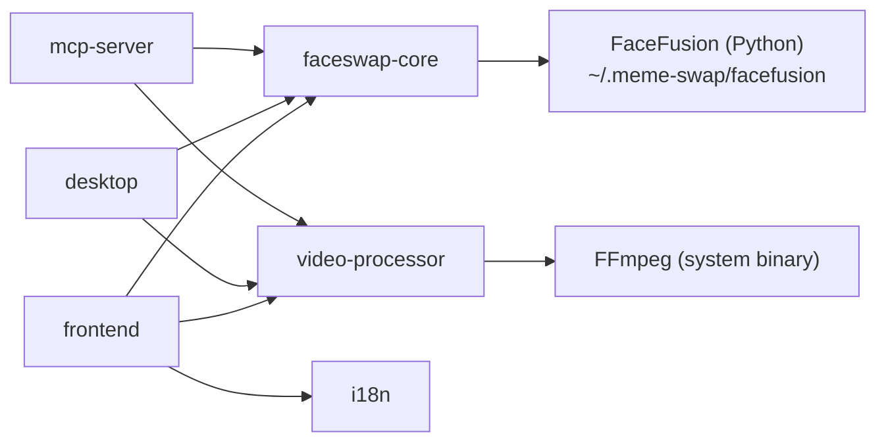
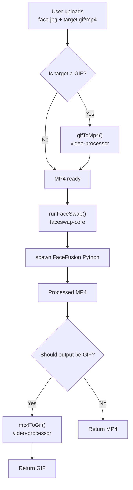

# Architecture

This document describes the technical architecture of the meme-swap monorepo.

---

## Monorepo Overview

meme-swap uses **Turborepo** as the build system with **pnpm workspaces**. Packages are built in dependency order, and each app consumes the shared packages as workspace references.

```
meme-swap/
├── apps/           → runnable applications
│   ├── frontend        (Next.js 16, port 3010)
│   ├── desktop         (Electron)
│   └── mcp-server      (Express + MCP SDK, port 3001)
│
└── packages/       → shared libraries
    ├── faceswap-core   (@meme-swap/faceswap-core)
    ├── video-processor (@meme-swap/video-processor)
    ├── api-client      (@meme-swap/api-client, Giphy client)
    └── i18n            (@meme-swap/i18n)
```

---

## Dependency Graph



---

## Applications

### `apps/frontend` — Web Application

| Detail    | Value                  |
| --------- | ---------------------- |
| Framework | Next.js 16, App Router |
| Port      | 3010 (dev)             |
| Styling   | TailwindCSS            |
| State     | React hooks            |

The frontend provides the main user-facing interface. Users upload a source face image and a target GIF or MP4, configure FaceFusion parameters, and download the processed result. The processing happens server-side via Next.js API routes that call `@meme-swap/faceswap-core` and `@meme-swap/video-processor`.

**Key files:**

- `app/page.tsx` — main UI page
- `app/api/faceswap/route.ts` — POST endpoint that orchestrates conversion + face swap
- `app/components/` — reusable UI components

### `apps/desktop` — Electron Application

| Detail    | Value         |
| --------- | ------------- |
| Framework | Electron      |
| Entry     | `src/main.ts` |

The desktop app wraps the processing pipeline in a native macOS application. On first launch, it runs a guided setup flow (`src/installer.ts`) to install FaceFusion into `~/.meme-swap/`. After setup, users interact with a normal application window to trigger face swaps; there is no system tray icon — closing the window quits the app (`window-all-closed` → `app.quit()`).

**Key files:**

- `src/main.ts` — Electron main process, window management
- `src/installer.ts` — first-time FaceFusion setup wizard
- `src/preload.ts` — context bridge between main and renderer
- `src/setup.html` — setup wizard HTML UI
- `src/loading.html` — loading screen

### `apps/mcp-server` — Model Context Protocol Server

| Detail    | Value                                        |
| --------- | -------------------------------------------- |
| Transport | HTTP + SSE (`StreamableHTTPServerTransport`) |
| Port      | 3001                                         |
| Protocol  | MCP (Model Context Protocol)                 |

Exposes face-swap capabilities as MCP tools so AI clients (Cursor, Claude Desktop) can trigger face swaps programmatically.

**Endpoints:**

- `GET  /mcp` — SSE stream for MCP connections
- `POST /message` — MCP message endpoint
- `GET  /health` — health check

**Exposed MCP tools:**

- `run_faceswap` — perform a face swap given a source image path and target media path

**Key files:**

- `src/server.ts` — Express server setup and MCP registration
- `src/tools/faceswap.ts` — `run_faceswap` tool implementation

---

## Packages

### `@meme-swap/faceswap-core`

TypeScript wrapper that spawns the FaceFusion Python process.

**How it works:**

1. Resolves the Python binary at `~/.meme-swap/facefusion/venv/bin/python3.11` (preferred) or `python3`/`python`
2. Resolves the FaceFusion script at `~/.meme-swap/facefusion/facefusion.py`
3. Spawns the process with the `headless-run` subcommand + all CLI arguments
4. Streams stdout/stderr and resolves on exit code 0

**Key constraint:** The target media **must be MP4**. GIF inputs must be converted first using `@meme-swap/video-processor`.

### `@meme-swap/video-processor`

FFmpeg wrapper for format conversion.

- **`gifToMp4`** — single-pass conversion with `faststart` for streaming
- **`mp4ToGif`** — two-pass approach: generate palette first, then apply it (higher quality output)

Default output settings: 10 fps, max width 320px.

### `@meme-swap/api-client`

A working Giphy API client (`giphy.search()`, `giphy.trending()`) used to power in-app GIF search. It resolves an API key through a fallback chain: browser `localStorage` key → Electron IPC (`window.electronAPI.searchGiphy`) → Next.js proxy route (`/api/giphy/*`) → server-side `GIPHY_API_KEY` env var → a curated static mock GIF list (`CURATED_FALLBACK_GIFS`) if nothing else is configured.

### `@meme-swap/i18n`

Shared translations package for UI strings. Used by the frontend and desktop apps.

---

## Data Storage

All runtime data lives under `~/.meme-swap/` in the user's home directory, completely decoupled from the project workspace:

| Path                            | Purpose                           |
| ------------------------------- | --------------------------------- |
| `~/.meme-swap/facefusion/`      | FaceFusion clone + Python venv    |
| `~/.meme-swap/facefusion/venv/` | Python virtual environment        |
| `~/.meme-swap/bin/`             | Copied ffmpeg / ffprobe binaries  |
| `~/.meme-swap/process/temp/`    | Temporary files during processing |
| `~/.meme-swap/process/results/` | Processing output files           |

This design means:

- The project repo contains no Python or model files
- Multiple apps can share a single FaceFusion installation
- The user's home directory is the canonical install location

---

## Media Processing Pipeline



---

## Architecture Decision Records

| ADR                                                  | Title                             | Status                                                                                                   |
| ---------------------------------------------------- | --------------------------------- | -------------------------------------------------------------------------------------------------------- |
| [ADR-0001](./adr/0001-dockerization-mcp-faceswap.md) | Dockerization of MCP + FaceFusion | Accepted (core decision — no Docker, Electron desktop app; see ADR note on the dropped tray-icon detail) |
